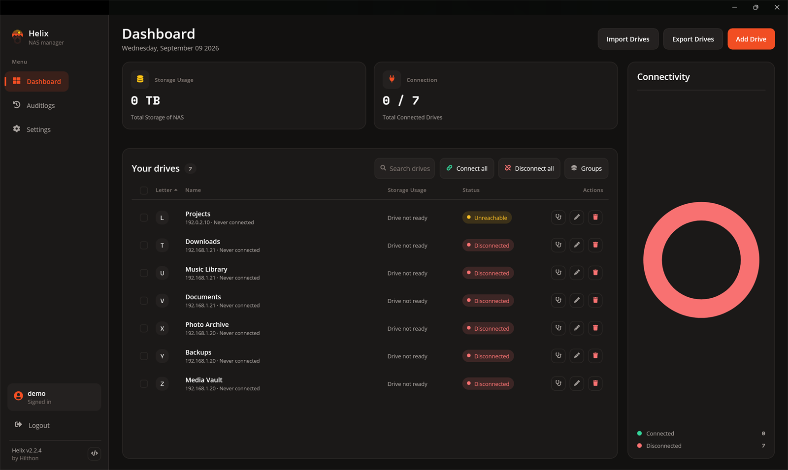
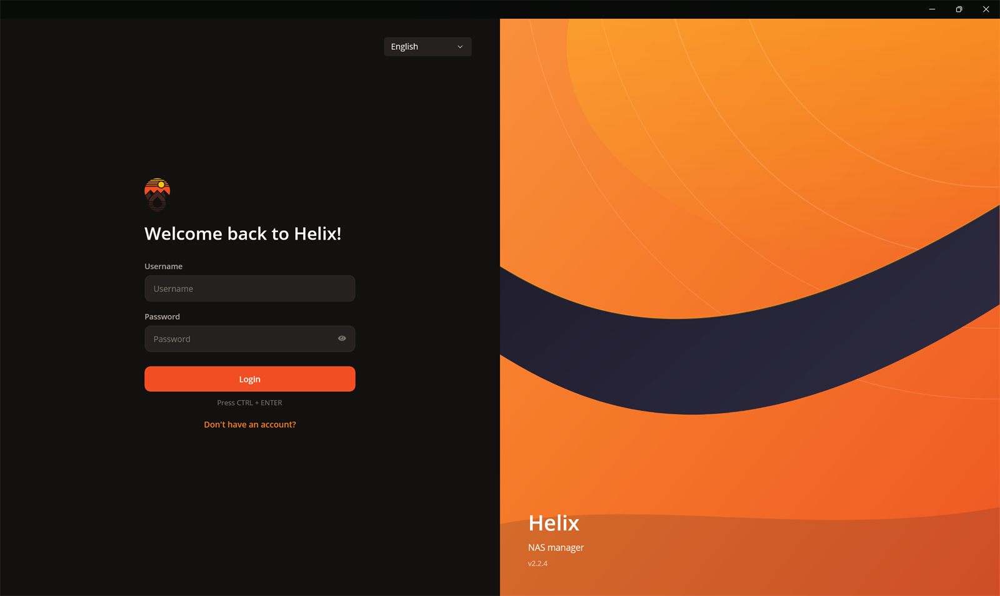
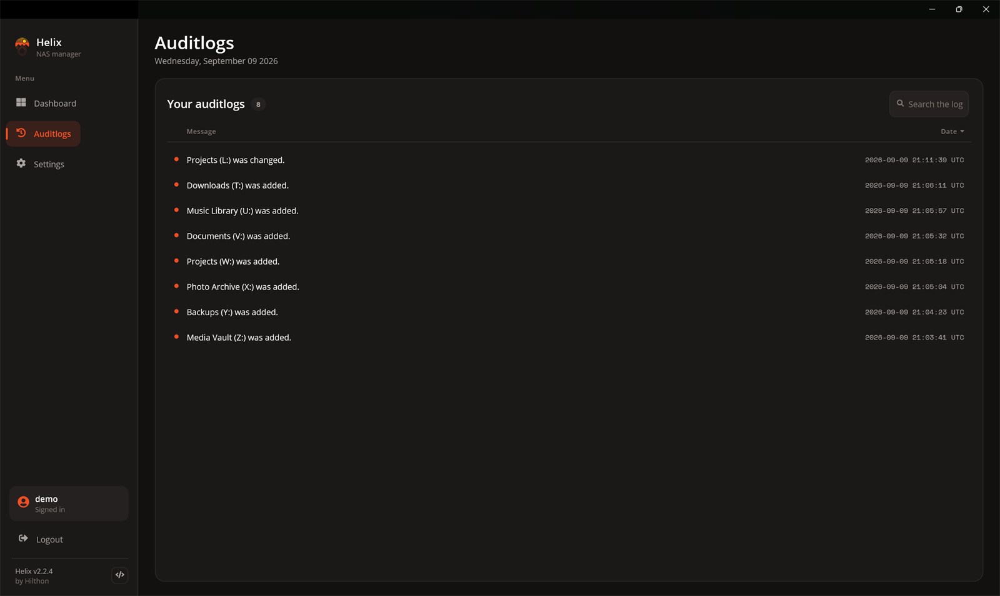
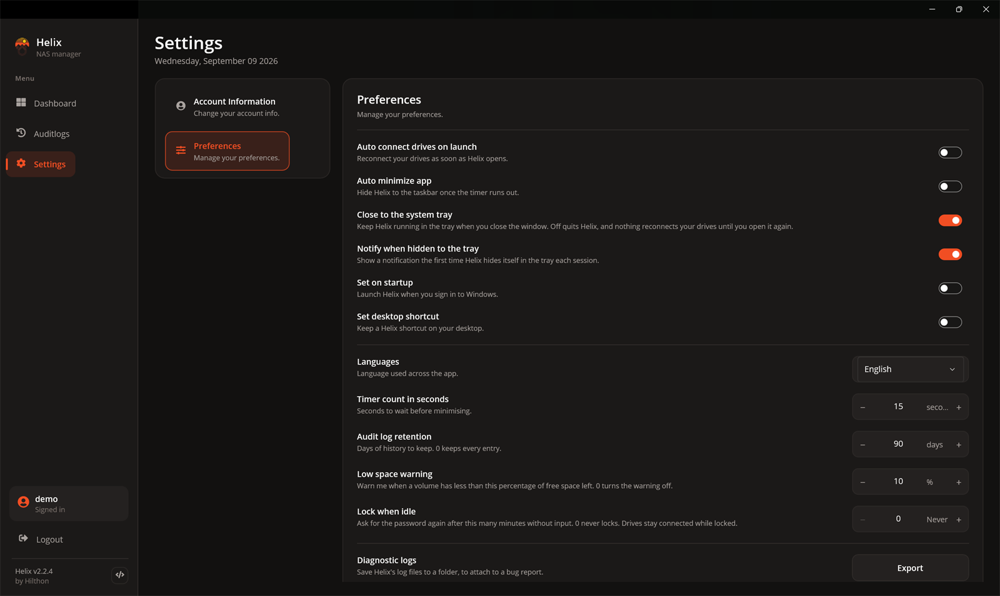
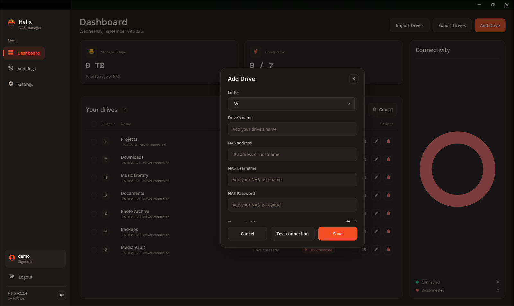

<div align="center">


# Helix

**A Windows desktop app for managing connections to your NAS drives.**

Map network shares to drive letters, monitor their status at a glance,
and keep your credentials encrypted at rest.

<br />

[](https://github.com/HilthonTT/Helix/actions/workflows/ci.yml)
[](https://github.com/HilthonTT/Helix/actions/workflows/codeql.yml)
[](https://github.com/HilthonTT/Helix/releases)
[](LICENSE)


</div>

<br />

<div align="center">
  
</div>

<br />

## Contents

- [Overview](#overview)
- [Screenshots](#screenshots)
- [Features](#features)
- [Security](#security)
- [Requirements](#requirements)
- [Getting Started](#getting-started)
- [Building and Testing](#building-and-testing)
- [Publishing to a Folder](#publishing-to-a-folder)
- [Continuous Integration](#continuous-integration)
- [Contributing](#contributing)
- [License](#license)

## Overview

Helix is a .NET MAUI desktop application for Windows that manages connections to NAS
(network-attached storage) drives. It maps network shares to Windows drive letters through
the native Win32 WNet API, reports live connection status and storage usage, and stores
your drive configurations in an encrypted local database.

## Screenshots

| Sign in | Audit log |
| --- | --- |
|  |  |

| Settings | Add a drive |
| --- | --- |
|  |  |

## Features

**Connect and disconnect drives.** Map network shares to drive letters individually or all
at once. Failed connections — an incorrect username or password, for example — are reported
with a clear per-drive message instead of interrupting the app.

**Connection dashboard.** See which drives are connected, total storage usage, and a live
status chart, all on one screen.

**Auto-connect on startup.** Optionally reconnect every drive when the app launches, and
start Helix with Windows.

**Encrypted import and export.** Back up your drive configurations to a passphrase-protected
`.helixvault` file (AES-256-GCM) and restore them on any machine.

**Audit log.** Every drive change is recorded automatically, so you can see what happened
and when.

**Multi-user.** Each account sees only its own drives, settings, and audit entries.

**Light and dark themes.** The interface follows the Windows system theme.

**Multilingual.** Available in English, French, German, Dutch, Indonesian, and Japanese.

## Security

- **Encrypted database.** The local SQLite database is encrypted with SQLCipher. The key is
  generated with a cryptographically secure RNG and held in Windows secure storage.
- **Password hashing.** Account passwords are hashed with PBKDF2-SHA512 (600,000 iterations,
  per OWASP guidance). Older hashes are transparently upgraded on sign-in.
- **Encrypted exports.** `.helixvault` files are encrypted with AES-256-GCM using a key
  derived from your passphrase via PBKDF2-SHA512.
- **Native credential handling.** Drive credentials are passed to Windows through the
  `mpr.dll` WNet API, never through a command line where they could be observed.
- **Per-user isolation.** All queries are scoped to the signed-in user; one account can
  never read another account's drives or logs.

Found a security issue? Please report it privately as described in [SECURITY.md](SECURITY.md)
rather than opening a public issue.

## Requirements

To run Helix:

- Windows 10 build 19041 or later

To build it:

- [Visual Studio 2022](https://visualstudio.microsoft.com/vs/) with the **.NET MAUI** workload
- [Git](https://git-scm.com/)

There is also a Mac Catalyst head (`net10.0-maccatalyst`), built on macOS with Xcode and the
`maui` workload. It is compile-verified in CI but not yet released; the packaging and
codesigning story below covers the Windows build only.

## Getting Started

```bash
git clone https://github.com/HilthonTT/Helix.git
```

Open `Helix.sln` in Visual Studio 2022, set `Helix.App` as the startup project, and run.

The MAUI app is normally launched from Visual Studio rather than `dotnet run`, because of its
Windows packaging configuration.

## Building and Testing

From the repository root:

```bash
dotnet build Helix.sln

dotnet test tests/Application.UnitTests/Application.UnitTests.csproj
dotnet test tests/Infrastructure.UnitTests/Infrastructure.UnitTests.csproj
dotnet test tests/ArchitectureTests/ArchitectureTests.csproj
```

To run a single test:

```bash
dotnet test tests/Application.UnitTests/Application.UnitTests.csproj --filter "FullyQualifiedName~CreateDriveTests"
```

## Publishing to a Folder

To compile the app into a single deployable folder (for example `C:\Helix`) containing
`Helix.App.exe` and everything it needs to run:

```powershell
Remove-Item C:\Helix -Recurse -Force -ErrorAction SilentlyContinue

dotnet publish src/Helix.App/Helix.App.csproj -c Release -f net10.0-windows10.0.19041.0 -p:RuntimeIdentifierOverride=win-x64 -o C:\Helix
```

The `dotnet publish` line is a single line on purpose, so it can be pasted into either shell
unchanged. Only the cleanup differs — in Command Prompt use `rd /s /q C:\Helix` instead of
`Remove-Item`.

Then start the app with `C:\Helix\Helix.App.exe`.

**Notes**

- The output is fully self-contained: the .NET runtime, the Windows App SDK runtime, and the
  native SQLCipher library are all included, so the target machine needs nothing pre-installed.
- **Clear the output folder first.** `dotnet publish -o` only adds and overwrites files; it
  never deletes ones the build no longer produces. A stale `resources.pri` left over from an
  earlier publish shadows the current `Helix.App.pri`, and because `MauiImage` assets are
  rasterised to scale-qualified files (`logoipsum.scale-100.png`, …) and resolved by name
  through that index, every image in the app silently renders blank.
- For ARM64 machines, use `-p:RuntimeIdentifierOverride=win-arm64` instead.
- **`-f` is required.** `Helix.App` targets more than one framework (a Windows head and a
  Mac Catalyst one), and `dotnet publish` refuses to guess which to produce — omitting it
  fails with `NETSDK1129: The 'Publish' target is not supported without specifying a target
  framework`. Only the framework for the machine you are on is available to select:
  `net10.0-windows10.0.19041.0` on Windows.
- `-p:RuntimeIdentifierOverride` (rather than the usual `-r`) is required. Passing the runtime
  identifier as a global CLI property would leak into the referenced class libraries and fail
  the Windows App SDK build. The override is read by `Helix.App.csproj` only, which turns it
  into a self-contained, RID-specific publish.
- The folder is portable — copy it to another location or machine and run it from there.
- **User data is not stored in this folder.** The encrypted database lives in the per-user app
  data directory (`%LOCALAPPDATA%`), so replacing or upgrading the published folder never
  touches your drives, settings, or audit entries.

### On macOS

Folder publishing is a Windows concept — the Catalyst head produces a signed `.app` bundle
instead, which needs an Apple signing identity. That flow is not set up yet. To compile the
macOS head on a Mac:

```bash
dotnet build src/Helix.App/Helix.App.csproj -f net10.0-maccatalyst
```

Build the app project rather than `Helix.sln`: the solution also contains the test projects,
which target `net10.0-windows` and cannot be built on macOS.

## Continuous Integration

Every push and pull request to `main` runs the [CI workflow](.github/workflows/ci.yml) on a
Windows runner:

1. Install the .NET 10 SDK and the MAUI workload
2. Restore and build `Helix.sln` in Release
3. Run the Application, Infrastructure, and Architecture test suites

Alongside it:

- **[CodeQL](.github/workflows/codeql.yml)** scans the C# sources and the workflows themselves
  on every push, every pull request, and weekly.
- **[Dependabot](.github/dependabot.yml)** opens grouped weekly pull requests for NuGet packages
  and GitHub Actions.
- **[Release](.github/workflows/release.yml)** builds self-contained `win-x64` and `win-arm64`
  folders when a `v*` tag is pushed, and attaches them to a GitHub release.

## Contributing

Contributions are welcome. See [CONTRIBUTING.md](CONTRIBUTING.md) for the development setup,
the handler pattern, the architecture rules enforced by tests, and the pull request checklist.
Participation is governed by our [Code of Conduct](CODE_OF_CONDUCT.md).

## License

Helix is licensed under the [MIT License](LICENSE).
